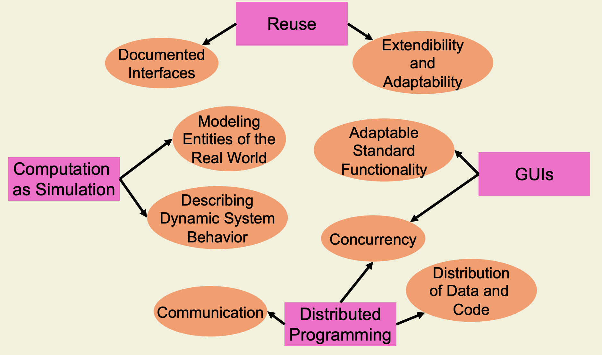
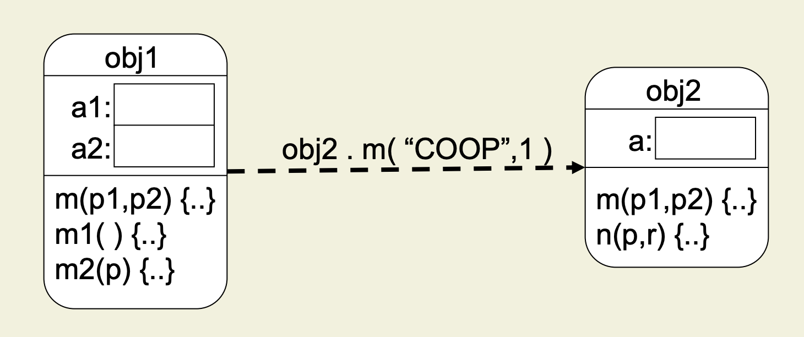
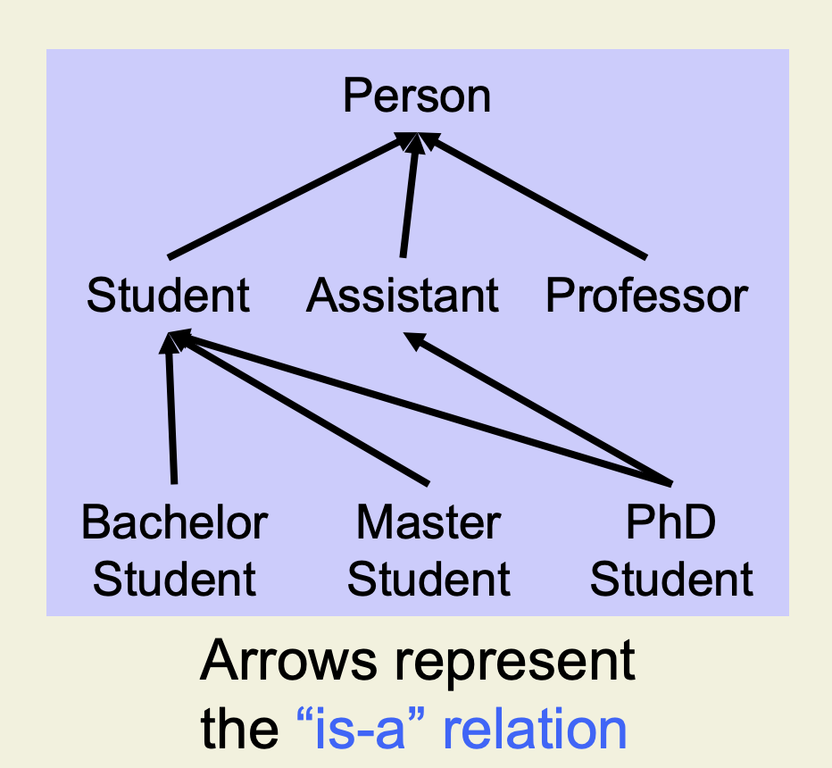

<style>
/* Limit the width of figures */
figure {
    max-width: 10px;
    margin: 0 auto; /* Center the figure horizontally */
}
/* Center tables */
table {
    margin: 0 auto; /* Center the table horizontally */
}
</style>

# Concepts of Objects Oriented Programming

## Table of Contents

- [Concepts of Objects Oriented Programming](#concepts-of-objects-oriented-programming)
  - [Table of Contents](#table-of-contents)
  - [Introduction](#introduction)
    - [Requirements](#requirements)
    - [Core Concepts](#core-concepts)
      - [1: The Object Model](#1-the-object-model)
      - [2: Interfaces and Encapsulation](#2-interfaces-and-encapsulation)
      - [3: Classification, Polymorphism and Specialization](#3-classification-polymorphism-and-specialization)
        - [Classification](#classification)
        - [Polymorphism](#polymorphism)
        - [Specialization](#specialization)
    - [Language Concepts](#language-concepts)
  - [Typing](#typing)
  - [Inheritance](#inheritance)

## Introduction

### Requirements

Every OOP language is (or should be) developed with the aim of solving a set of requirments,  shown in the picture below. 


### Core Concepts

Core concepts are abstract concepts to meet the (new) requirements discussed in the previous section.

#### 1: The Object Model

In every OOP language, **a software system is a set of cooperating objects**, which **exchange messages**. In the figure below, two objects `obj1`and `obj2` can be seen exchanging a message, in the form of a *method call*.
Every object has:
- State
- Identity
- Lifecycle
- Location
- Behavior



#### 2: Interfaces and Encapsulation

Each object has a well-defined interface, which describes its **publicly accessible fields and methods**. **Encapsulation** refers to the bundling of data with the methods that operate on that data, and is often used to hide the values or state of a structured data object inside a class.

#### 3: Classification, Polymorphism and Specialization

##### Classification

We call **classification** the process of hierarchicarly structuring objects. Each object **can belong to different classes simultaneously**, an example is provided below.
This lead to the **substitution principle**: each object of a type `S` which is subtype of a type `T` can be used whenever the supertype `T` is expected. Looking at the example below, if a method expects an object of type `Assistant`, it will also accept an object of type `PhD Student` (but not `bachelor Student` or `Master Student`!).



##### Polymorphism

We call a program part **polymorphic** if it can be used for objects of several classes.
There exist various forms of polymorphism:
- **Subtype polymorphism**: program parts working with supertype objects work as well with subtype objects
- **Parametric ploymorphism** (generic types): using **type parameters** it ensures that one implementation can be used for different types and type mismatches can be detected at compile time  
- Ad-hoc polymorphism (method overloading): it allows several methods with the same name but different arguments

<center><table><tr>
<th>An example of parametric polymorphism</th>
<th>An example of ad-hoc polymorphism</th>
</tr><tr><td><pre>

```java
class List<G> { // G: type parameter
  G[ ] elems;
  void append( G p ) { … }
}
// Working code
List<String> myList;
myList = new List<String>( );
myList.append( “String” );
// Failing code 
myList.append( myList );
```
</pre></td><td>

```java
class Any {
  void foo( Polar p ) { … }
  void foo( Coord c ) { … }
}
// Working code
x.foo( new Coord( 5, 10 ) );
```
</td></tr></table></center>

##### Specialization

We call **specialization** the action fo adding specific properties to an object or refining a concept by adding further characteristics.
The process usually unfolds as follows:
- Start from general objects or types
- Extend these objects and their implementations (add properties)
  
When specializing some property, the behavior of the specialized objects has to be compliant to behavior of more general objects: program parts that work for the more general objects must work for specialized objects too. An example is given below.

```java
class Person {
  String name;
  void print() {
    System.out.println(name);
  }
}
```

```java
class Student extends Person {
  int regNum;
  void print() {
    super.print(); 
    System.out.println(regNum);
  }
}
```

### Language Concepts

Language concepts enable and facilitate the application of the core concepts, as they give us the ability to express them in programs.

## Typing


## Inheritance

<!-- aa
<table><tr>
<th>Json 1</th>
<th>Markdown</th>
</tr><tr><td><pre>

```json
{
  "id": 1,
  "username": "joe",
  "email": "joe@example.com",
  "order_id": "3544fc0"
}
```
</pre></td><td>

```json
{
  "id": 5,
  "username": "mary",
  "email": "mary@example.com",
  "order_id": "f7177da"
}
```
</td></tr></table> -->
