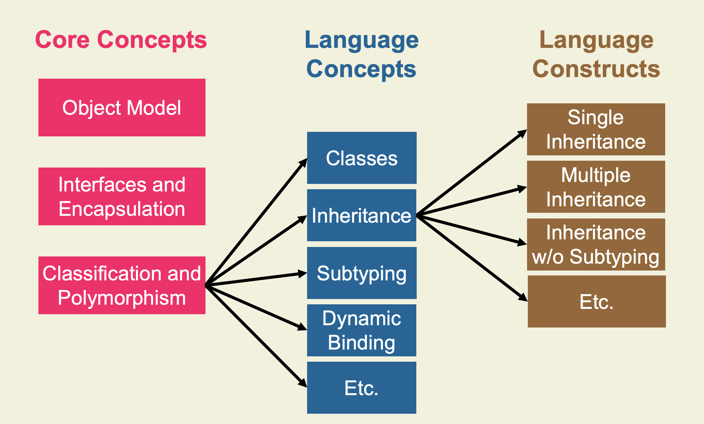
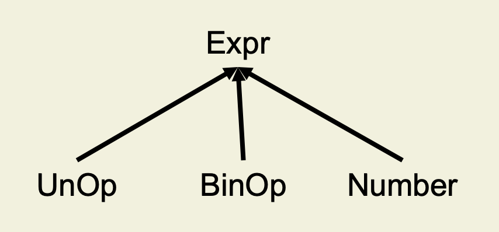

<style>
/* Limit the width of figures */
figure {
    max-width: 10px;
    margin: 0 auto; /* Center the figure horizontally */
}
/* Center tables */
table {
    margin: 0 auto; /* Center the table horizontally */
}
</style>

# Concepts of Objects Oriented Programming

## Table of Contents

- [Concepts of Objects Oriented Programming](#concepts-of-objects-oriented-programming)
  - [Table of Contents](#table-of-contents)
  - [Introduction](#introduction)
    - [Requirements](#requirements)
    - [Core Concepts](#core-concepts)
      - [1: The Object Model](#1-the-object-model)
      - [2: Interfaces and Encapsulation](#2-interfaces-and-encapsulation)
      - [3: Classification, Polymorphism and Specialization](#3-classification-polymorphism-and-specialization)
        - [Classification](#classification)
        - [Polymorphism](#polymorphism)
        - [Specialization](#specialization)
    - [Language Concepts](#language-concepts)
      - [An example in `C`](#an-example-in-c)
        - [Types and Objects](#types-and-objects)
        - [Methods and Constructors](#methods-and-constructors)
        - ["Using" the Object](#using-the-object)
        - [Inheritance and Specialization](#inheritance-and-specialization)
        - [Subclassing and Dynamic Binding](#subclassing-and-dynamic-binding)
        - [Pros and Cons of our `C` solution](#pros-and-cons-of-our-c-solution)
      - [A JAVA Solution](#a-java-solution)
    - [Summary](#summary)
    - [Design Goals](#design-goals)
      - [Simplicity](#simplicity)
      - [Expressiveness](#expressiveness)
      - [(Static) Safety](#static-safety)
      - [Modularity](#modularity)
      - [Performance](#performance)
      - [Productivity](#productivity)
      - [Backwards Compatibility](#backwards-compatibility)
  - [Typing](#typing)
  - [Inheritance](#inheritance)

## Introduction

### Requirements

Every OOP language is (or should be) developed with the aim of solving a set of requirments,  shown in the picture below. 


Let's look at an example: reusing procedural programs. e will try and model the scenario of an University Administration System which:
- Models students and professors
- Stores one record for each student and each professor in a repository
- Has a procedure `printAll` that prints all records in the repository

We will accomplish this, by writing a `C` program. For now, ignore all the things that follow the `// A` comments.
```c
typedef struct {
  char *name;
  char *room;
  char *institute;
} Professor;

typedef struct {
  char *name;
  int regNum;
} Student;

// A
typedef struct {
  char *name;
  char PhD_student; /* ‘y‘, ‘n‘ */
} Assistant;
```
```c
void printStudent( Student *s )
  { … }

void printProf( Professor *p )
  { … }

// A
void printAssi( Assistant *a )
  { … }
```
```c
typedef struct {
  enum { STU,PROF } kind;
  // A: enum { STU,PROF,ASSI } kind;
  union {
    Student *s;
    Professor *p;
    Assistant *a; // A
  } u;
} Person;

typedef Person **List;
```
```c
void printAll( List l ) {
  int i;
  for ( i=0; l[ i ] != NULL; i++ )
  switch ( l[ i ] -> kind ) {
    case STU:
      printStudent( l[ i ] -> u.s );
      break;
    case PROF:
      printProf( l[ i ] -> u.p );
      break;
    // A
    case ASSI:
      printAssi( l[ i ] -> u.a );
      break;
  }
}
```
If we now wanted to extend our implementation, and add assistants to the system, we would have to:
- Add record and print function for assistants
- Reuse old code for repository and printing

This is all the stuff in the listings above that you were told to ignore (marked with `// A`)!

### Core Concepts

Core concepts are abstract concepts to meet the (new) requirements discussed in the previous section.

#### 1: The Object Model

In every OOP language, **a software system is a set of cooperating objects**, which **exchange messages**. In the figure below, two objects `obj1`and `obj2` can be seen exchanging a message, in the form of a *method call*.
Every object has:
- State
- Identity
- Lifecycle
- Location
- Behavior


#### 2: Interfaces and Encapsulation

Each object has a well-defined interface, which describes its **publicly accessible fields and methods**. **Encapsulation** refers to the bundling of data with the methods that operate on that data, and is often used to hide the values or state of a structured data object inside a class.

#### 3: Classification, Polymorphism and Specialization

##### Classification

We call **classification** the process of hierarchicarly structuring objects. Each object **can belong to different classes simultaneously**, an example is provided below.
This lead to the **substitution principle**: each object of a type `S` which is subtype of a type `T` can be used whenever the supertype `T` is expected. Looking at the example below, if a method expects an object of type `Assistant`, it will also accept an object of type `PhD Student` (but not `bachelor Student` or `Master Student`!).


##### Polymorphism

We call a program part **polymorphic** if it can be used for objects of several classes.
There exist various forms of polymorphism:
- **Subtype polymorphism**: program parts working with supertype objects work as well with subtype objects
- **Parametric ploymorphism** (generic types): using **type parameters** it ensures that one implementation can be used for different types and type mismatches can be detected at compile time  
- Ad-hoc polymorphism (method overloading): it allows several methods with the same name but different arguments

<center><table><tr>
<th>An example of parametric polymorphism</th>
<th>An example of ad-hoc polymorphism</th>
</tr><tr><td><pre>

```java
class List<G> { // G: type parameter
  G[ ] elems;
  void append( G p ) { … }
}
// Working code
List<String> myList;
myList = new List<String>( );
myList.append( “String” );
// Failing code 
myList.append( myList );
```
</pre></td><td>

```java
class Any {
  void foo( Polar p ) { … }
  void foo( Coord c ) { … }
}
// Working code
x.foo( new Coord( 5, 10 ) );
```
</td></tr></table></center>

##### Specialization

We call **specialization** the action fo adding specific properties to an object or refining a concept by adding further characteristics.
The process usually unfolds as follows:
- Start from general objects or types
- Extend these objects and their implementations (add properties)
  
When specializing some property, the behavior of the specialized objects has to be compliant to behavior of more general objects: program parts that work for the more general objects must work for specialized objects too. An example is given below.

```java
class Person {
  String name;
  void print() {
    System.out.println( name );
  }
}
```

```java
class Student extends Person {
  int regNum;
  void print() { // We specialize print()
    super.print(); 
    System.out.println( regNum );
  }
}
```

### Language Concepts

Language concepts enable and facilitate the application of the core concepts, as they give us the ability to express them in programs.
An example of such a concept is **dynamic method binding**: it allows the method implementation to be selected at run time depending on the type of the receiver object. That enables the classification and polymorphism of objects, and allows us to write things like (please refer to the diagram in the classification section)
```c
void printAll( Person[ ] l ) {
  for (int i=0; l[ i ] != null; i++)
    l[ i ] . print( );
}
```
without encurring into bugs or crashes.

#### An example in `C`

Before continuing, we will now try and write an object-oriented program in `C` (a procedural language). Our aim is to write a `Person` class, with a `name` field, a `print` method that prints the name of the person and a `lastName` method that returns the last name of the person.

##### Types and Objects

We first start by defining our own types
```c
typedef char* String;
typedef struct sPerson Person;
```
and "objects" (records with fields and methods, as function pointers)
```c
struct sPerson {
  String name;
  void ( *print )( Person* );
  String ( *lastName )( Person* );
};
```
##### Methods and Constructors

We are now ready to define our methods
```c
void printPerson( Person *this ) {
  printf(“Name: %s\n“, this->name);
}
String LN_Person( Person *this )
  { … }
```
and constructors
```c
Person *PersonC( String n ) {
  Person *this = (Person *)
  malloc( sizeof( Person ) );
  this -> name = n;
  this -> print = printPerson;
  this -> lastName = LN_Person;
  return this;
}
```

##### "Using" the Object

We can now utilize the object in code by using its constructors, fields and methods
```c
Person *p;
p = PersonC( “Tony Hoare“ );
p->name = p->lastName( p );
p->print( p );
```
##### Inheritance and Specialization

Say that we now want to implement `Student` as a subclass of `Person`.
To allow for inheritance, a lot of code has to be copied and adapted
```c
typedef struct sStudent Student;
struct sStudent {
  String name;
  void ( *print )( Student* );       // We change the pointer from
  String ( *lastName )( Student* );  // Person to Student
  int regNum;
};
```
With that done, we still have to define the specialized methods
```c
void printStudent( Student *this ) {
  printf(“Name: %s\n“, this->name);
  printf(“No: %d\n“, this->regNum);
}
```
We are now ready to write the constructor for `Student`
```c
Student *StudentC( String n, int r ) {
  Student *this = (Student *) malloc( sizeof( Student ) );
  this -> name = n;
  this -> print = printStudent;
  // We can reause LN_Person but in order to do that
  // we must cast the pointer
  this -> lastName = (String (*)(Student*)) LN_Person;
  this -> regNum = r;
  return this;
}
```
##### Subclassing and Dynamic Binding

With our `Student` class ready, we can use it in code
```c
Student *s;
Person *p;
s = StudentC( “Susan Roberts“, 0 );
p = (Person *) s; // Notice the NECESSARY cast
p -> name = p -> lastName( p );
p -> print( p );
```
and even exploit dynamic method binding
```c
void printAll( Person **l ) {
  int i;
  for ( i=0; l[ i ] != NULL; i++ )
    l[ i ] -> print( l[ i ] );
}
```
`l` can contain both `Person` and `Student` objects, the correct method will be selected dynamically.

##### Pros and Cons of our `C` solution

|  **Pros** |  **Cons** |
|---|---|
|  We can express objects, fields, methods, constructors, and dynamic method binding |  Inheritance has to be replaced by code duplication |
| By imitating OO-programming, the union in `Person` and the `switch` statement in `printAll` became dispensable | Subtyping can be simulated, but it requires <ul><li>Casts, which is not type safe </li><li>Same memory layout of super and subclasses (same fields and function pointers in same order), which is extremely error-prone</li></ul> |
| The behavior of reused code (`Person`, `printAll`) can be adapted (to introduce `Student`) without changing the implementation | `C`-solution includes undefined behavior (it violates the strict aliasing rule) |
|| Appropriate language support is needed to apply object-oriented concepts |

#### A JAVA Solution

What would our program look like, if we instead of `C` decided to use the OO programming lnguage JAVA?
```c
class Person {
  String name;
  void print( ) {
    System.out.println( “Name: “ + name );
  }
  StringlastName( ) { … }
  Person( String n ) { name = n; }
}
```
```c
class Student extends Person {
  int regNum; // Specialization
  void print( ) {
    super.print( );
    System.out.println( “No: “ + regNum ); // Specialization
  }
  Student( String n, int i ) {
    super( n );
    regNum = i; // Specialization
  }
}
```
```c
void printAll( Person[ ] l ) {
  for (int i=0; l[ i ] != null; i++)
    l[ i ].print( );
}
```
This solution is simpler and smaller, easier to maintain (due to the absence of code duplication) and type safe!
It uses:
- **Inheritance** to avoid code duplication
- **Subtyping** to express classification
- **Overriding** to specialize methods
- **Dynamic binding** to adapt reused algorithms

Java supports the OO-language concepts!

### Summary

The following diagrams presents a summary of everything that has been discussed so far:



### Design Goals

A good OO-language is not one that many people use, nor one that makes programmers productive.
A good OO-language should resolve design trade-offs in a way suitable for its application domain. For this, we define a set of **design goals** that every OO-language should try accomplishing.

#### Simplicity

Syntax and semantics should be easily understood by users and implementers of the language.

```eiffel
-- An example in Eiffel
factorial ( i: INTEGER ): INTEGER
  require 0 <= i
once -- Note the simplicity of "once"
  if i <= 1 then Result := 1
  else
    Result := i
    Result := Result * factorial ( i – 1 )
  end
end
```

Examples of simple languages: Pascal, C, Java 1.0.

#### Expressiveness

The language should (easily) express complex processes and structures. This design goal often clashes with the "simplicity" goal.

```scala
// An example in Scala
def simplify( expr: Expr ): Expr =
expr match {
  case UnOp( “–“, UnOp("–“,e) ) => e
  case BinOp( "+", e, Number(0) ) => e
  case BinOp( “*", e, Number(1) ) => e
  case _ => expr
}
```
The above code allows us to easily express the structure pictured below.



Examples of expressive languages: C#, Scala, Python.

#### (Static) Safety

The language discourages errors and allows errors to be discovered and reported, ideally at compile time. This design goal often clashes with expressiveness and performance.

```java
// An example in Java
int foo( List<Integer> l, int i ) {
  if ( l.get( 0 ) != i ) return i / 5;
  else return 0;
}
// Following code crashes
List<Integer> l;
l = new ArrayList<Integer>();
l.add( 7 );
foo( l, “5“ );
```

```python
# An example in Python
def foo( l, i ):
  if l[ 0 ] != i: return i / 5
  else: return 0
# Following code crashes, NOT at compile time
l = [ ]
l.append( 7 )
foo( l, “5“ )
```
Examples of safe languages: Java, C#, Rust, Scala.

#### Modularity 

The language allows modules to be type-checked and compiled separately. This design goal often clashes with expressiveness and performance.

```cpp
// An example in C++
template<class T> class C {
public:
  int foo( T p ) { return p->bar( ); };
};

class D { }

int main( int argc, char* argv[ ] ) {
  C<D*> c;
  int t = c.foo( new D() );
  return 0;
}
```

Examples of modular languages: Java, C#, Scala.

#### Performance

Programs written in the language should be executed efficiently.
This design goal often clashes with safety and simplicity.

As an example, let's look at how two different programming languages (C++ and Java) handle arrays:
| **C++** | **Java** |
|---|---|
| Sequence of memory locations | Sequence of memory locations plus length |
| Access is simple look-up (only 2-5 machine instructions) | Access is look-up plus bound-check |

Examples of efficient languages: C, C++, Rust.

#### Productivity

The language should lead to low costs of writing programs. This design goal is closely related to expressiveness, and therefore often clashes with static safety and performance as well.

```python
# An example in python
def qsort( lst ):
  if len( lst ) <= 1:
    return lst

  pivot = lst.pop( 0 )
  
  greater_eq = qsort( [ i for i in lst if i >= pivot ] )
  lesser = qsort( [ i for i in lst if i < pivot ] )

  return lesser + [ pivot ] + greater_eq
```
Examples of languages for high productivity: Visual Basic, Python.

#### Backwards Compatibility

Newer language versions should work and interface with programs in older versions. This design goal often clashes with simplicity, performance, and expressiveness.

```java
// An example in Java
class Tuple<T> {
  T first; T second;
  void set( T first, T second ) {
    this.first = first;
    this.second = second;
  }
}
// Following code interfaces with the old version of the software (above)
class Client {
  static void main( String[ ] args ) {
    Tuple t = new Tuple();
    t.set( "Hello", new Client() );
  }
}
```
Examples of backwards compatible languages: Java, C.


## Typing


## Inheritance

<!-- aa
<table><tr>
<th>Json 1</th>
<th>Markdown</th>
</tr><tr><td><pre>

```json
{
  "id": 1,
  "username": "joe",
  "email": "joe@example.com",
  "order_id": "3544fc0"
}
```
</pre></td><td>

```json
{
  "id": 5,
  "username": "mary",
  "email": "mary@example.com",
  "order_id": "f7177da"
}
```
</td></tr></table> -->
